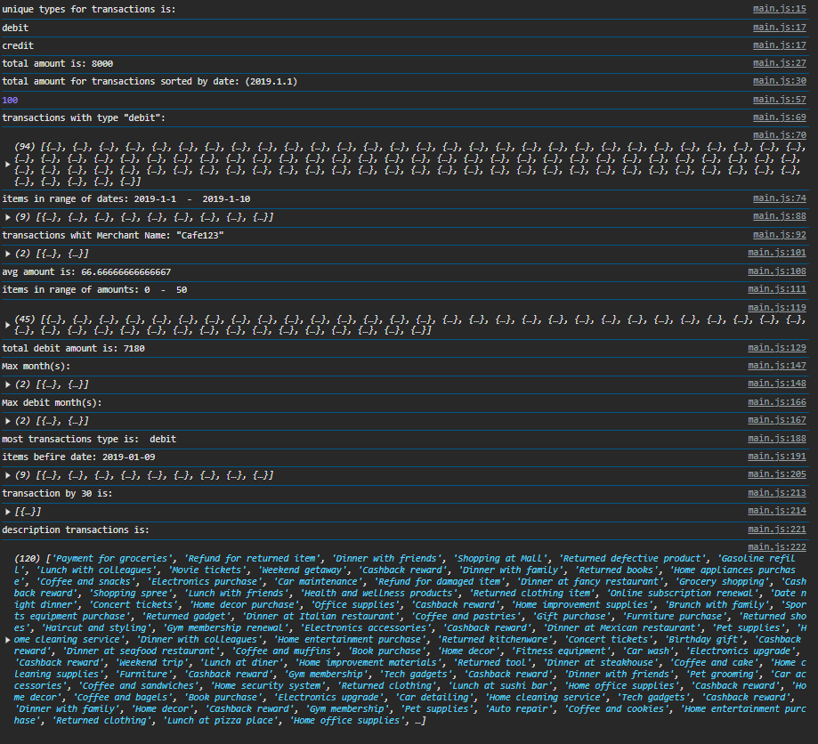
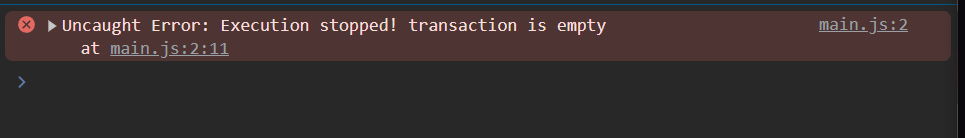
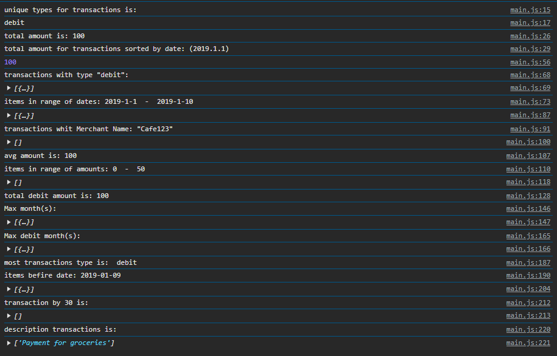

# Лабараторная №2 `Anisimov Victor IA2403`

## Оглавление
- [Инструкции по запуску проекта](#запуск-проекта)
- [Описание лабораторной работы](#описание-лабораторной-работы)
- [Список функций](#список-функций)
- [Вызов и результат использования ](#вызов-и-результат-использования)
- [Ответы на контрольные вопросы](#ответы-на-контрольные-вопросы)
- [Список использованных источников](#список-использованных-источников)

## Запуск проекта
- Открытие файла `index.html`
- Открытия консоли браузера, чреез `F12` или `конекстное меню->код элемента`

## Описание лабораторной работы
Цель лабораторной работы — разработать консольное приложение для анализа транзакций. Программа обрабатывает массив транзакций и предоставляет функции для фильтрации, сортировки и анализа данных.

## Список функций
Приложение содержит следующие функции:

### 1. getUniqueTransactionTypes(transactions)
Возвращает массив уникальных типов транзакций.
```js
function getUniqueTransactionTypes(transactions){
    let types_of_transactions=[];
    for(const item of transactions){
        types_of_transactions.push(item.transaction_type);
    }
    return Array.from(new Set(types_of_transactions));
}
```

### 2. calculateTotalAmount(transactions)
Вычисляет сумму всех транзакций.
```js
function calculateTotalAmount(transactions){
    return transactions.reduce((sum, transaction) => sum + transaction.transaction_amount, 0);
}
```

### 3. calculateTotalAmountByDate(transactions, year, month, day)
Вычисляет сумму транзакций за указанный период.
```js
function calculateTotalAmountByDate(transactions, year, month, day){
    const filteredTransactions = transactions.filter(transaction => {
        const date = new Date(transaction.transaction_date);
        return (!year || date.getFullYear() == year) &&
               (!month || date.getMonth() + 1 == month) &&
               (!day || date.getDate() == day);
    });
    return filteredTransactions.reduce((sum, transaction) => sum + transaction.transaction_amount, 0);
}
```

### 4. getTransactionByType(transactions, type)
Возвращает массив транзакций указанного типа (`debit` или `credit`).
```js
function getTransactionByType(transactions, type){
    return transactions.filter(item => item.transaction_type === type);
}
```
### 5. getTransactionsInDateRange(transactions, startDate, endDate) 
Возвращает массив транзакций, проведенных в указанном диапазоне дат от `startDate` до `endDate`.
```js
function getTransactionsInDateRange(transactions, startDate, endDate){
    console.log(`items in range of dates: ${startDate}  -  ${endDate}`);
      const start = new Date(startDate);
      const end = new Date(endDate);
    
      const filtered_transactions = transactions.filter(transaction => {
          const transaction_date = new Date(transaction.transaction_date);

          return transaction_date >= start && transaction_date <= end;
      });
  
      return filtered_transactions;
}
```
### 6. getTransactionsByMerchant(transactions, merchantName) 
Возвращает массив транзакций, совершенных с указанным `merchantName`.
```js
function getTransactionsByMerchant(transactions, merchant_name){
    right_transactions=[];
    console.log(`transactions whit Merchant Name: \"${merchant_name}\"`);
    for(const item of transactions){
        if(merchant_name==item.merchant_name)
            right_transactions.push(item);
    }
    return right_transactions;
}
```
### 7. calculateAverageTransactionAmount(transactions) 
Возвращает среднее значение транзакций.
```js
function calculateAverageTransactionAmount(transactions){
    return calculateTotalAmount(transactions)/transactions.length;
}
```
### 8. getTransactionsByAmountRange(transactions, minAmount, maxAmount) 
Возвращает массив транзакций с суммой в заданном диапазоне от `minAmount` до `maxAmount`.
```js
function getTransactionsByAmountRange(transactions, minAmount, maxAmount){
    console.log(`items in range of amounts: ${minAmount}  -  ${maxAmount}`);
    const right_transactions = transactions.filter(transaction =>{
        return transaction.transaction_amount>= minAmount && transaction.transaction_amount<=maxAmount;
    })
    return right_transactions;
}
```
### 9.calculateTotalDebitAmount(transactions) 
Вычисляет общую сумму дебетовых транзакций.
```js
function calculateTotalDebitAmount(transactions){
    const total_amount = getTransactionByType(transactions, "debit")
    .reduce((sum,transaction) => sum + transaction.transaction_amount, 0);

    return total_amount;
}
```
### 10. findMostTransactionsMonth(transactions) 
Возвращает месяц, в котором было больше всего транзакций.
```js
function findMostTransactionsMonth(transactions){
    let month_amount =[];
    for(let i = 0; i<transactions.length;i++){
        const date = new Date(transactions[i].transaction_date);
        if(month_amount.some(item => item.month === date.getMonth()+1)) 
            continue;
        const this_month = transactions.filter((transaction) =>date.getMonth() === new Date(transaction.transaction_date).getMonth()).length;
        month_amount.push({amount : this_month, month : date.getMonth() + 1});
    }
    const max = Math.max(...month_amount.map(value=>value.amount));
    const max_month = month_amount.filter(item => item.amount===max);

    return max_month;
}
```
### 11. findMostDebitTransactionMonth(transactions)
Возвращает месяц, в котором было больше дебетовых транзакций.
```js
function findMostDebitTransactionMonth(transactions){
    let month_amount =[];
    for(let i = 0; i<transactions.length;i++){
        const date = new Date(transactions[i].transaction_date);
        if(month_amount.some(item => item.month === date.getMonth()+1)) 
            continue;
        const this_month = transactions.filter((transaction) => transaction.transaction_type === "debit" && date.getMonth() === new Date(transaction.transaction_date).getMonth()).length;
        month_amount.push({amount : this_month, month : date.getMonth() + 1});
    }
    const max = Math.max(...month_amount.map(value=>value.amount));
    const max_month = month_amount.filter(item => item.amount===max);

    return max_month;
}
```
### 12. mostTransactionTypes(transactions)
Возвращает каких транзакций больше всего.
Возвращает `debit`, если дебетовых.
Возвращает `credit`, если кредитовых.
Возвращает `equal`, если количество равно.
```js
function mostTransactionTypes(transactions){
    const totals = transactions.reduce((acc, transaction) => {
        if (transaction.type === "debit") {
            acc.total_debit ++;
        } else if (transaction.type === "credit") {
            acc.total_credit ++;
        }
        return acc;
    }, { total_debit: 0, total_credit: 0 });
    if(total_debit>total_credit){
        return "debit";
    } else if(total_debit<total_credit){
        return "credit";
    } 
    return "equal";
}
```
### 13. getTransactionsBeforeDate(transactions, date)
Возвращает массив транзакций, совершенных до указанной даты.
```js
function getTransactionsBeforeDate(transactions, date){
    console.log(`items befire date: ${date}`);

      const end = new Date(date);
    
      const filtered_transactions = transactions.filter(transaction => {
          const transaction_date = new Date(transaction.transaction_date);

          return transaction_date <= end;
      });
  
      return filtered_transactions;
}
```
### 14. findTransactionById(transactions, id)
Возвращает транзакцию по ее уникальному идентификатору (`id`).
```js
function findTransactionById(transactions, id){
    return transactions.filter(item => item.transaction_id === String(id));
}
```
### 15. mapTransactionDescriptions(transactions)
Возвращает новый массив, содержащий только описания транзакций.
```js
function mapTransactionDescriptions(transactions){
    return transactions.map(item => item = item.transaction_description);
}
```

## Вызов и результат использования 
код, показывающий результаты работы всех функций:
```js
 const unique_transactions = getUniqueTransactionTypes(transactions);
 console.log("unique types for transactions is:");
 for(const item of unique_transactions){
    console.log(item);
 } 

 const sum = calculateTotalAmount(transactions);
 console.log(`total amount is: ${sum}`);

 const sum1 = calculateTotalAmountByDate(transactions, 2019, 1,1);
 console.log(sum1);

 const trans_by_type = getTransactionByType(transactions, "debit");
 console.log("transactions with type \"debit\":");
 console.log(trans_by_type);

 const trans_by_two_dates = getTransactionsInDateRange(transactions, "2019-1-1", "2019-1-10");
 console.log(trans_by_two_dates); 
 const trans_by_merchant = getTransactionsByMerchant(transactions, "Cafe123");
 console.log(trans_by_merchant);

 const avg_amount = calculateAverageTransactionAmou(transactions);
 console.log(`avg amount is: ${avg_amount}`);
 
 const trans_by_amount_range = getTransactionsByAmountRange(transactions, 0, 50);
console.log(trans_by_amount_range);

const total_debit_amount = calculateTotalDebitAmount(transactions);
console.log(`total debit amount is: ${total_debit_amount}`);

const max_month = findMostTransactionsMonth(transactions);
console.log("Max month(s):");
console.log(max_month);

const max_month_debit = findMostDebitTransactionMonth(transactions);
console.log("Max debit month(s):")
console.log(max_month_debit);

const most_trans_type = mostTransactionTypes(transactions);
console.log(`most transactions type is:  ${most_trans_type}`);

const trans_before_date = getTransactionsBeforeDate(transactions, "2019-01-09")
console.log(trans_before_date);

const transaction_by_id = findTransactionById(transactions, "30");
console.log("transaction by 30 is:");
console.log(transaction_by_id);

const description_trans = mapTransactionDescriptions(transactions);
console.log("description transactions is:");
console.log(description_trans);
```
#### Результат(при данном масиве):


#### Результат при пустом массиве, выдаётся предусмотренная ошибка:


#### Результат при массиве из первой транзакции данного массива:


## Ответы на контрольные вопросы
1. **Какие методы массивов можно использовать для обработки объектов в JavaScript?**
   - `map(), filter(), reduce(), forEach(), some(), every(), find(), sort(), splice(), concat()`.
2. **Как сравнивать даты в строковом формате в JavaScript?**
   - Использовать `new Date(dateString)`, а затем `getTime()`, `getFullYear()`, `getMonth()`, `getDate()` для сравнения.
3. **В чем разница между `map()`, `filter()` и `reduce()`?**
   - `map()` создает новый массив, трансформируя элементы исходного массива.
   - `filter()` создает новый массив, содержащий только элементы, соответствующие условию.
   - `reduce()` выполняет вычисления (например, суммирование) над массивом и возвращает единое значение.

## Список использованных источников
- [GitHub(массив)](https://github.com/MSU-Courses/javascript/blob/main/lab/LL_02/files/transactions.js)
- [GitHub(условия оформления)](https://github.com/MSU-Courses/javascript/blob/main/lab/lab_guidelines.md)
- [Moodle(условия лабораторной)](https://moodle.usm.md/mod/assign/view.php?id=300743)
- [Stack Overflow](https://stackoverflow.com/)
- [JavaScript.info](https://learn.javascript.ru/)

