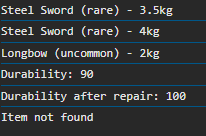

# Лабараторная №3 `Anisimov Victor IA2403`

## Оглавление
- [Инструкции по запуску проекта](#запуск-проекта)
- [Описание лабораторной работы](#описание-лабораторной-работы)
- [Список классов](#список-классов)
- [Вызов и результат использования ](#вызов-и-результат-использования)
- [Использования функции-конструкторов](#использования-функции-конструкторов)
- [Ответы на контрольные вопросы](#ответы-на-контрольные-вопросы)
- [Список использованных источников](#список-использованных-источников)

## Запуск проекта
- Открытие файла `index.html`
- Открытия консоли браузера, чреез `F12` или `конекстное меню->код элемента`

## Описание лабораторной работы
Познакомиться с классами и объектами в JavaScript, научиться создавать классы, использовать конструкторы и методы, а также реализовать наследование.

## Список классов
Приложение содержит следующие классы:

### 1. Item
Поля:
```js
    name;
    weight;
    rarity;
```

Методы:
```js
    /**
     * Returns information about the item.
     * @returns {string} Info string.
     */
    getInfo() {
      return `${this.name} (${this.rarity}) - ${this.weight}kg`;
    }
  
    /**
     * Updates the weight of the item.
     * @param {number} newWeight - New weight to set.
     */
    setWeight(newWeight) {
      this.weight = newWeight;
    }
```

### 2. Weapon
- Наследует класс [Item](#1-item)
Поля:
```js
    damage;
    durability;
```

Методы:
```js
    /**
     *Using the weapon, reducing durability.
     */
    use() {
      if (this.durability > 0) {
        this.durability = Math.max(0, this.durability - 10);
      }
    }
  
    /**
     * Repairs the weapon to full durability.
     */
    repair() {
      this.durability = 100;
    }
```

## Вызов и результат использования 
```js
  const sword = new Item("Steel Sword", 3.5, "rare");
  console.log(sword.getInfo());
  sword.setWeight(4.0);
  console.log(sword.getInfo());
  
  const bow = new Weapon("Longbow", 2.0, "uncommon", 15, 100);
  console.log(bow.getInfo());
  bow.use();
  //Use ?.
  console.log(`Durability: ${bow?.durability}`);
  bow.repair();
  console.log(`Durability after repair: ${bow?.durability}`);

  const inventory = [sword, bow];
  console.log(inventory[5]?.getInfo() ?? "Item not found");
```

## Использования функции-конструкторов
```js
  /**
   * @constructor
   * @param {string} name
   * @param {number} weight
   * @param {string} rarity
   */
  function ItemConstructor(name, weight, rarity) {
    this.name = name;
    this.weight = weight;
    this.rarity = rarity;
  }
  ItemConstructor.prototype.getInfo = function () {
    return `${this.name} (${this.rarity}) - ${this.weight}kg`;
  };
  ItemConstructor.prototype.setWeight = function (newWeight) {
    this.weight = newWeight;
  };
  
  /**
   * @constructor
   * @param {string} name
   * @param {number} weight
   * @param {string} rarity
   * @param {number} damage
   * @param {number} durability
   */
  function WeaponConstructor(name, weight, rarity, damage, durability) {
    ItemConstructor.call(this, name, weight, rarity);
    this.damage = damage;
    this.durability = durability;
  }
  WeaponConstructor.prototype = Object.create(ItemConstructor.prototype);
  WeaponConstructor.prototype.constructor = WeaponConstructor;
  
  WeaponConstructor.prototype.use = function () {
    if (this.durability > 0) {
      this.durability = Math.max(0, this.durability - 10);
    }
  };
  
  WeaponConstructor.prototype.repair = function () {
    this.durability = 100;
  };
```
### **Вывод**<br>

## Ответы на контрольные вопросы
1. **Какое значение имеет this в методах класса?**

this — это ссылка на объект, который вызывает метод. То есть, когда ты создаёшь объект на основе класса и вызываешь его метод, this внутри метода указывает на этот объект. Это позволяет методам обращаться к полям и другим методам этого же объекта.

2. **Как работает # в JavaScript?**
Символ # делает свойство или метод приватным — это значит, что к нему нельзя получить доступ снаружи объекта. Только внутри самого класса можно использовать такие поля. Это нужно для защиты внутренней логики и данных объекта.

3. **Чем отличаются классы от функций-конструкторов?**
Классы — это современный и более понятный способ создания объектов. Они выглядят чище, позволяют легко делать наследование и поддерживают приватные поля.<br>Функции-конструкторы — это старый способ, который использовался до появления классов. Они тоже создают объекты, но писать их сложнее, особенно если нужно сделать наследование. Сейчас лучше использовать классы.
## Список использованных источников
- [GitHub(массив)](https://github.com/MSU-Courses/javascript/blob/main/lab/LL_02/files/transactions.js)
- [GitHub(условия оформления)](https://github.com/MSU-Courses/javascript/blob/main/lab/lab_guidelines.md)
- [Moodle(условия лабораторной)](https://moodle.usm.md/mod/assign/view.php?id=300745)
- [Stack Overflow](https://stackoverflow.com/)
- [JavaScript.info](https://learn.javascript.ru/)
