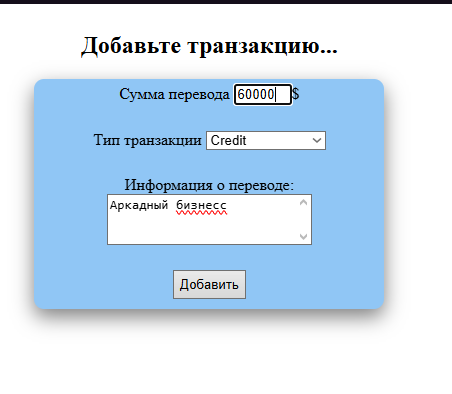
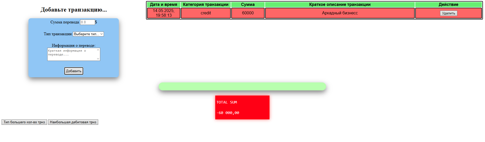
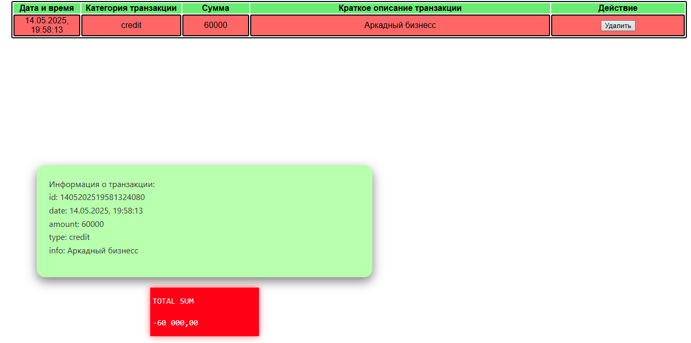
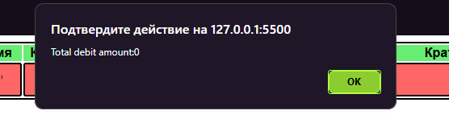

# Лабараторная №4 `Anisimov Victor IA2403`

## Оглавление
- [Инструкции по запуску проекта](#запуск-проекта)
- [Описание лабораторной работы](#описание-лабораторной-работы)
- [Список функции](#список-функции) 
- [Вызов и результат использования](#вызов-и-использование)
- [Ответы на контрольные вопросы](#ответы-на-контрольные-вопросы)
- [Список использованных источников](#список-использованных-источников)

## Запуск проекта
- Откройте VS Code, с расширением **"Live Server"**.
- Справа снизу есть полу **"Go Life"** или контекстное меню html файла -> запустить сервер.

## Описание лабораторной работы
Ознакомить студентов с основами взаимодействия JS с DOM-деревом на основе веб-приложения для учета личных финансов.

## Список функции
Всего есть 4 функциональный файла:
- index.js
- ui.js
- transactions.js
- utils.js

**<big>index.js</big>**<br>
Реализует главнуй связь с формой

код:
```js
import {GetDataForm} from './ui.js';
import {form} from './ui.js';
form.addEventListener('submit', GetDataForm);
```

**<big>ui.js</big>**<br>
Реализует все функции связанные с обработкой событий и элементов на экране

- Функция получения данных и частичное их валидация(остальная реализована в html):
```js
export function GetDataForm(event){
    event.preventDefault(); // не перезагружать страницу
    const formData = new FormData(form); //метод получение струтурированных данных формы через имя
    if(0>Number(formData.get("sum")) || Number(formData.get("sum"))>10000000 ){
        const errMsg = document.createElement("div");
        errMsg.innerHTML = "<p style =\"background-color: brown; color: white;\">incorect amount: must be positive and less then 10,000,000</p>";
        form.appendChild(errMsg);
        setTimeout(()=>errMsg.remove(), 5000);
    }
    else{
        addTransaction(formData);
    }
}
```

- Функция добавления транзакции в массив транзакций.<br>
[пользовательская функция **generateId**](#запуск-проекта)
```js
export function addTransaction(data) {
    const now = new Date();
    const formattedDate = now.toLocaleString('ru-RU');
    const newId = generateId(formattedDate); 
    const transaction = {
        id: newId,
        date: formattedDate,
        amount: Number(data.get("sum")),
        type: data.get("type"),
        info: data.get("info")
    };

    transactions.push(transaction); // сохраняем

    renderTransaction(transaction); // отображаем
    document.getElementById("add").reset();
    updateTotalSum();
}
```

- Функция отображения транзакции
```js
function renderTransaction(tx) {
    const newRow = document.createElement("tr");
    newRow.dataset.id = tx.id; //сохраняем в видном месте id транзакции, для дальнейшей обработки
    newRow.addEventListener('click', handleRowClick);
    const cell1 = document.createElement("td");
    const cell2 = document.createElement("td");
    const cell3 = document.createElement("td");
    const cell4 = document.createElement("td");
    const sum = document.createElement("td");

    cell1.textContent = tx.date;
    cell2.textContent = tx.type;
    cell3.textContent = tx.info;
    sum.textContent = tx.amount;

    const btnDlt = document.createElement('button');
    btnDlt.textContent = "Удалить";
    btnDlt.onclick = () => {
        table.removeChild(newRow);
        // Удалим и из массива
        const index = transactions.indexOf(tx);
        if (index > -1) transactions.splice(index, 1);
        const bl = document.getElementById("row2_1");
        bl.innerHTML = '';
        updateTotalSum();
    };
    cell4.appendChild(btnDlt);

    newRow.appendChild(cell1);
    newRow.appendChild(cell2);
    newRow.appendChild(sum);
    newRow.appendChild(cell3);
    newRow.appendChild(cell4);

    if(tx.type === "debit")
        newRow.id="debit-g";
    else if(tx.type === "credit")
        newRow.id="credit-r";
    table.appendChild(newRow);
}
```

- Функция считывания нажатия на запись таблицы
```js
function handleRowClick(event) {
    if (event.target.tagName.toLowerCase() === 'button') return; // пропускаем кнопки

    const row = event.currentTarget;
    const id = row.dataset.id;

    const transaction = transactions.find(t => t.id === id);
    changeInfo(transaction);
}
```

- Функция изменения поля вывода ифнормации о транзакции
```js
function changeInfo(transaction){
    const bl = document.getElementById("row2_1");
    bl.innerHTML = '';
    const parag = document.createElement("p");
    parag.innerHTML = `
    Информация о транзакции:<br>
        id: ${transaction.id} <br>
        date: ${transaction.date} <br>
        amount: ${transaction.amount} <br>
        type: ${transaction.type} <br>
        info: ${transaction.info}
    `;
    bl.appendChild(parag);
}
```

- Функция подсчёта общей суммы, учитывая прибыль и убыль
```js
function updateTotalSum(){
    const sum = document.getElementById("total_sum").lastElementChild;

    let total_amount = 0;

    for (const tx of transactions) {
        const amount = Number(tx.amount);
        if (tx.type === "debit") {
            total_amount += amount;
        } else if (tx.type === "credit") {
            total_amount -= amount;
        }
    }

    sum.innerText = total_amount.toLocaleString("ru-RU", { minimumFractionDigits: 2 });
}
```

- Код, для реализации одной из функций на сайте, написанной в одной из прошлых лабораторных работ, связанных с транзакциями. Происходит некоторая обработка полученного результата работы функции `mostTransactionTypes` и привязка к кнопке
```js
function buttonMostTransactionTypes(){
    if(transactions.length==0){
    alert("transactions is empty");
    }
   
    const trns = mostTransactionTypes(transactions);
    alert(trns);
}
 document.getElementById("most_trns_type").addEventListener('click', buttonMostTransactionTypes)
```

- Подобная схема, что для предыдущей функцией, но для функции  `calculateTotalDebitAmount`.

```js
function buttonTotalDebitAmount(){
    if(transactions.length==0){
    alert("transactions is empty");
    }
   
    const trns = calculateTotalDebitAmount(transactions);
    alert("Total debit amount:"+trns);
}
document.getElementById("total_debi_amount").addEventListener('click', buttonTotalDebitAmount)
```


**<big>utils.js</big>**<br>

- Функция создания уникального id для транзакции, основанная на точном времени и дополнительного числа от 0 до 1*10<sup>5</sup>.

```js
export function generateId(time) {
    time = time.replace(/[.,: ]/g, '');
    const rand = Math.floor(Math.random() * 1e5);
    return `${time}${rand}`;
}
```


## Вызов и использование

Сначала надо ввести правельные данные в форму:


Если данные введены правильно, то запись будет добавленная в таблицу справа:



Можно заметить общий счёт, пустую строку и пару кнопок. Начнём со строки - при нажатии на запись в таблице на её месте будет выводится подробная информация о транзакции. Взаимодействовать с информацией нельзя.
 
 

Кнопки:
1. Тип большего кол-во трнз

2. Наибольшая дебитовая трнз

Во втором случае результат 0, т.к. в таблице нету озаписей транзакций типа *debit*


## Ответы на контрольные вопросы
🔹 1. Как получить доступ к элементу на веб-странице?<br>
С помощью методов DOM, например:

```js
document.getElementById('id')
document.querySelector('.class')
document.querySelectorAll('div')
```
🔹 2. Что такое делегирование событий?<br>
Это техника, когда один обработчик вешается на родительский элемент, а события обрабатываются для его потомков с помощью event.target.

Пример:

```js
document.getElementById('list').addEventListener('click', function(event) {
  if (event.target.tagName === 'LI') {
    console.log('Clicked item:', event.target.textContent);
  }
});
```
Полезно при работе с множеством динамических элементов.

🔹 3. Как изменить содержимое элемента DOM?<br>
После получения элемента:

```js
element.textContent = 'Новый текст';
element.innerHTML = '<b>Жирный текст</b>';
```
🔹 4. Как добавить новый элемент в DOM?<br>
Создаёшь элемент, задаёшь ему свойства и вставляешь:

```js
const newDiv = document.createElement('div');
newDiv.textContent = 'Привет!';
document.body.appendChild(newDiv);
```


## Список использованных источников
- [GitHub(условия оформления)](https://github.com/MSU-Courses/javascript/blob/main/lab/lab_guidelines.md)
- [Moodle(условия лабораторной)](https://moodle.usm.md/mod/assign/view.php?id=300747)
- [Stack Overflow](https://stackoverflow.com/)
- [JavaScript.info](https://learn.javascript.ru/)